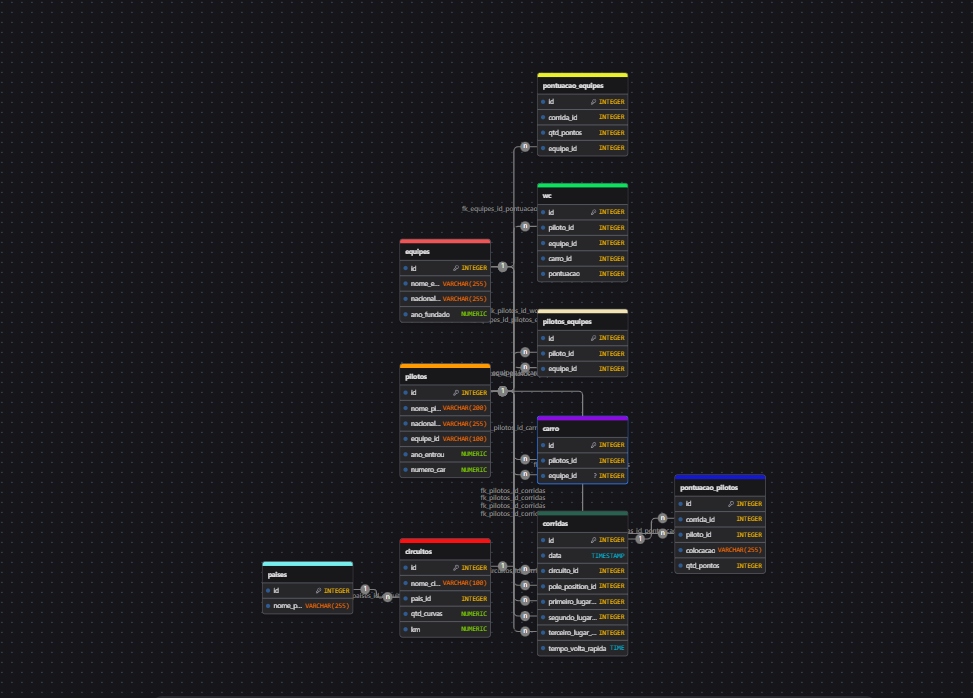

# Projeto formula 1
**Desenvolvido por:** Luana, Sanches e natalia
##

Eu e as meninas super poderosas conhecidas como Luana, Natalia e Sanches decidimos que fariamos o projeto sobre fórmula 1, separamos as tarefas de acordo com as preferencias de cada uma. 

Luana- ficou responsável por criar as tabeças no drawDB com as informações que a sanches ia falando e com a ajuda do professor para tirar algumas duvidas e organizar os slides;

Natalia- ficou responsável por criar o banco de dados no PostgreSQL atraves da tabela que a Luana montou no drawDB, e por organizar os slides;

Sanches- ficou responsável  por criar o e planejar o python da melhor forma possível e organizar os slides;

# Modelo do drawDB #   

